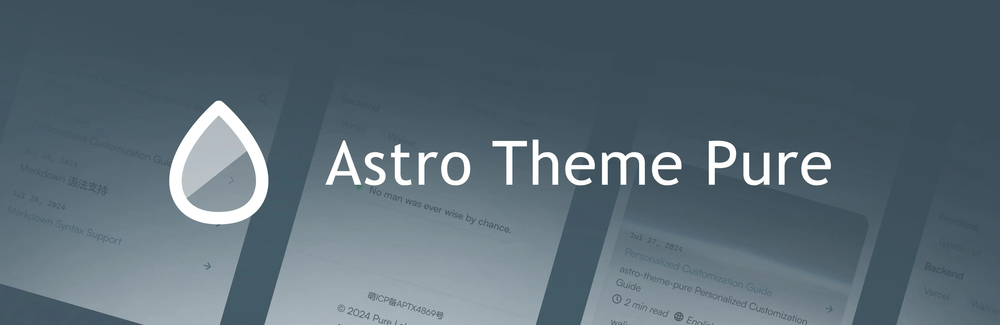
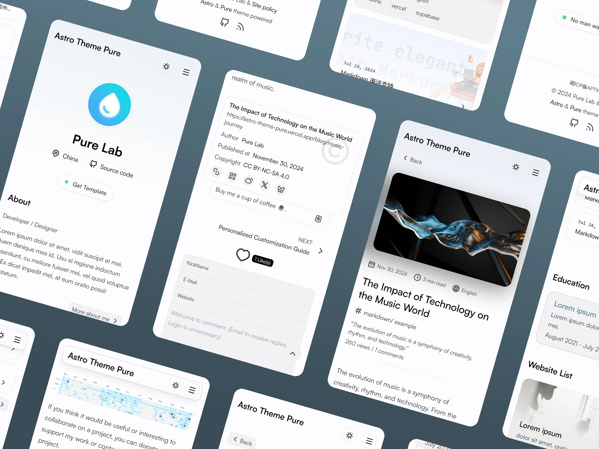
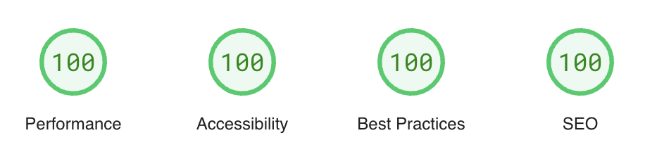

# Astro Theme Pure

[English](./README.md) | [简体中文](./README-zh-CN.md)

A simple, fast and powerful blog theme built by Astro.

[](https://astro-pure.js.org/)
[](https://www.npmjs.com/package/astro-pure)
[](https://github.com/cworld1/astro-theme-pure/releases)
[](https://github.com/cworld1/astro-theme-pure/blob/main/LICENSE)




> [!WARNING]
> Theme template v4.0.2^ is changing CSS engine to UnoCSS. Stabler experience is currently on [v4.0.1-beta](https://github.com/cworld1/astro-theme-pure/tree/v4.0.1-beta). Known issues:
>
> 1. UnoCSS adaption (serious)
> 2. Cannot pack sitemap and pagefind resources on Vercel ([need upstream fix](https://github.com/withastro/astro/issues/12663) & temp fixed)
> 3. Header & customize options is still under development (template exposed still)

## Introduction

Checkout [Demo Site →](https://astro-pure.js.org/)

### :fire: Features

- [x] :rocket: Fast & high performance
- [x] :star: Simple & clean design
- [x] :iphone: Responsive design
- [x] :mag: Full-site search built with [pagefind](https://pagefind.app/)
- [x] :world_map: Sitemap & RSS feed
- [x] :spider_web: SEO-friendly
- [x] :book: TOC (table of contents)
- [x] :framed_picture: Dynamic open graph generation for posts
- [x] :framed_picture: Mediumzoom lightbox for images

### :package: Components

Theme includes a lot of components, which can not only be used in the theme, but also in other astro projects.

> For other astro projects, Tailwind CSS is required.

- Basic components: `Aside`, `Tabs`, `Timeline`, `Steps`, `Spoiler`...
- Advanced components: `GithubCard`, `LinkPreview`, `Quote`, `QRCode`...

### :white_check_mark: Lighthouse score

[](https://pagespeed.web.dev/analysis/https-cworld-top/o229zrt5o4?form_factor=mobile&hl=en)

## Documentation

[Docs](https://astro-pure.js.org/docs) | [Showcase](https://github.com/cworld1/astro-theme-pure/issues/10)

## Package

See [astro-theme-pure](https://www.npmjs.com/package/astro-pure) on npm.

## Local development

Environment requirements:

- [Nodejs](https://nodejs.org/): 18.0.0+

Clone the repository:

```shell
git clone https://github.com/cworld1/astro-theme-pure.git
cd astro-theme-pure
```

Useful commands:

```shell
# install dependencies
bun install

# start the dev server
bun dev

# build the project
bun run build

# preview (after the build)
bun preview

# create a new post
bun new-post
```

## Contributions

To spend more time coding and less time fiddling with whitespace, this project uses code conventions and styles to encourage consistency. Code with a consistent style is easier (and less error-prone!) to review, maintain, and understand.

## Thanks

- [Astro Cactus](https://github.com/chrismwilliams/astro-theme-cactus)
- [Astro Resume](https://github.com/srleom/astro-theme-resume)
- [Starlight](https://github.com/withastro/starlight)

## License

This project is licensed under the Apache 2.0 License.

[](https://star-history.com/#cworld1/astro-theme-pure&Date)
